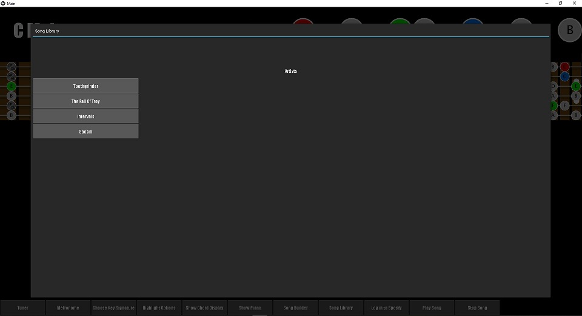

# fiGUItarout

### Kivy + PyGuitarPro + Spotify + Music Theory

Choose any guitar tuning, any key key signature, and see it displayed on the fretboard and piano.

Change highlight options as desired.

Display all chords and voicings that belong in this key signature.

Load GuitarPro files in.

Edit and save them for later (alternate endings and D.S. al coda repeats must be fixed manually).

Retrieve from your SongLibrary.

Log in to Spotify.

Play your song!
[Watch video!](https://imgur.com/a/IYHCI7l)

Throw some horns.  
:metal::metal::metal:
