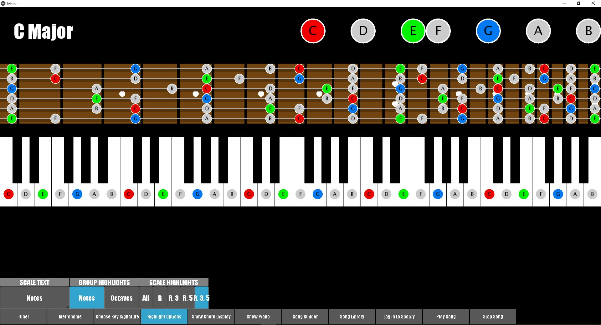
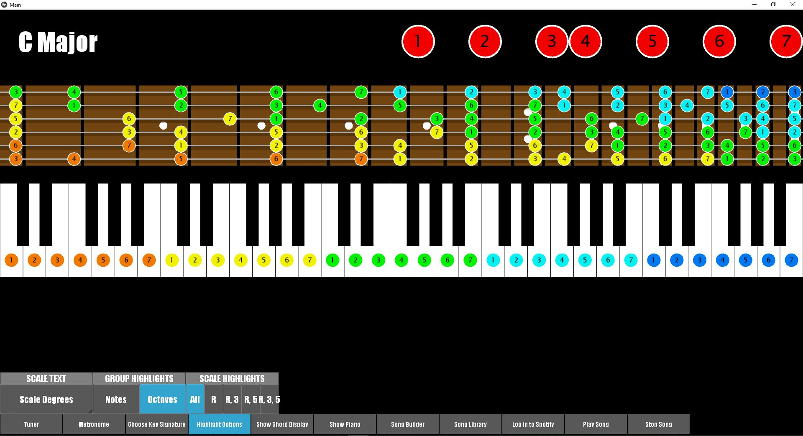
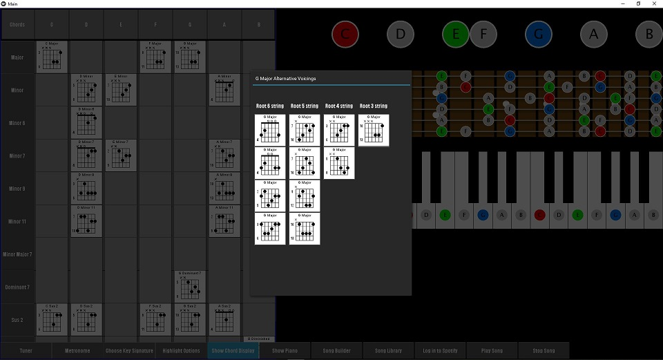

# fiGUItarout

### Kivy + PyGuitarPro + Spotify + Music Theory

Choose any guitar tuning, any key key signature, and see it displayed on the fretboard and piano.

Change highlight options as desired.

Display all chords and voicings that belong in this key signature.

